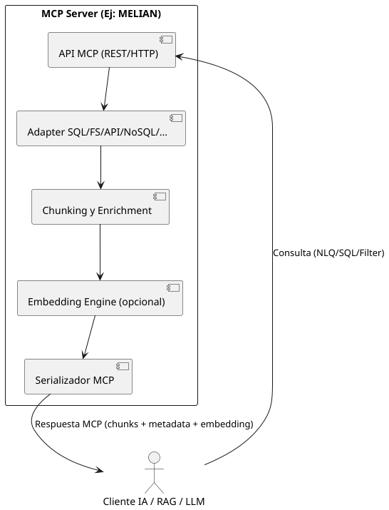

# 🟢 ¿Qué es MCP y un MCP Server? (Dev Java Friendly)

---

### **MCP (Model Content Protocol)**

- Protocolo abierto para exponer información estructurada y semántica  
  (chunks, metadata, embeddings) de cualquier fuente de datos.
- Estandariza el intercambio entre sistemas y modelos de IA/RAG.

---
### **¿Qué es un MCP Server?**  

### **MCP Server**

- Microservicio que implementa MCP y expone:
    - Endpoint universal de consulta (REST/HTTP)
    - Adaptadores para cualquier backend (SQL, NoSQL, archivos, APIs…)
    - Chunking y enriquecimiento de datos
    - (Opcional) Embedding vectorial para búsquedas semánticas
    - Respuesta JSON MCP con chunks, metadata y embeddings listos para IA

---

### **¿Por qué es clave?**

- Desacopla frontends y motores IA de las fuentes legacy o heterogéneas.
- Facilita la integración RAG/IA en cualquier empresa, sin reescribir integraciones.
- Abierto, extensible y multiplataforma (Spring Boot, Java, Python…).

---

### **Analogía**

> “Así como REST te permite exponer datos como recursos web,  
> MCP te permite exponer *chunks de conocimiento* para IA, listos para usar en RAG y chatbots.”

---

### **Ejemplo práctico**

1. El LLM o frontend pregunta:  
   `"Dame los reportes financieros de Q1 2023"`
2. El MCP Server responde:  
   `chunks + metadata + embeddings`
3. El sistema RAG usa esos chunks para dar respuestas precisas y contextuales.

---

### **En síntesis**

- **MCP**: estándar para chunks de conocimiento.
- **MCP Server**: microservicio universal para IA/RAG.
