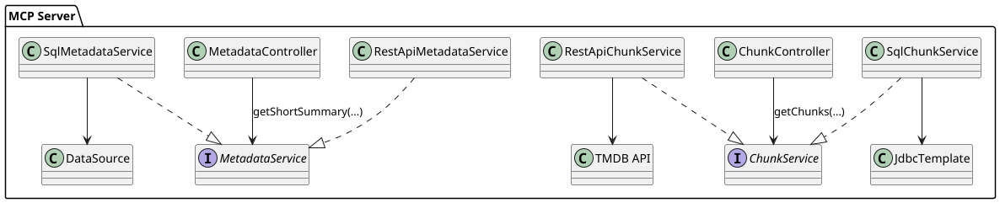

# MELIAN

> **Módulo de Embedding y Lógica Inteligente para Acceso Natural**

---
<p align="center">
  
</p>
---

## ¿Qué es MELIAN?

**MELIAN** es tu asistente digital abstracto para la integración y exposición inteligente de datos empresariales.  
No es solo un software: es un *personaje* que entiende, transforma y sirve conocimiento a cualquier dominio de tu organización.

MELIAN se implementa como un **MCP Server** (Model Content Protocol), capaz de conectarse a bases de datos, archivos, APIs, documentos, planillas y sistemas legacy,  
y exponer chunks enriquecidos, embeddings y metadata lista para potenciar aplicaciones RAG y clientes de IA como [EvolvAI](https://github.com/tu-org/evolvai).


## ¿Qué es el Protocolo MCP?

> 📚 Referencias oficiales:
> - [MCP GitHub Repo (langchain4j)](https://github.com/langchain4j/mcp)
> - [LangChain4j - Model Content Protocol Overview](https://github.com/langchain4j/langchain4j/blob/main/docs/model-content-protocol.md)
> - [MCP en LangChain4j Docs](https://docs.langchain4j.dev/integrations/mcp/)
>
> 📖 Recursos complementarios:
> - [LangChain JS - Model Content Protocol](https://js.langchain.com/docs/integrations/model_content_protocol/)
> - [Artículo: “Serving Chunks and Metadata with MCP”](https://medium.com/@langchain/serving-chunks-and-metadata-to-rag-apps-ec7b9a0c1d13)
> - [Video explicativo: What is MCP? (YouTube)](https://www.youtube.com/watch?v=9frCYmBOAlY)


**MCP (Model Content Protocol)** es un protocolo abierto y estandarizado que permite a los servidores exponer:
- Estructura de metadatos (metadata) que describe tablas, columnas, relaciones, tipos y descripciones.
- Contenido textual dividido en “chunks” que puede ser embebido, indexado y consultado por modelos de lenguaje (LLMs).

Este protocolo facilita la interoperabilidad entre múltiples fuentes de datos (SQL, APIs, archivos...) y consumidores inteligentes como sistemas RAG, agentes autónomos, asistentes virtuales o dashboards inteligentes.

### ¿Qué define un MCP Server?

Un servidor MCP debe cumplir con las siguientes interfaces públicas:
- `GET /mcp/metadata`: entrega metadata completa del dominio conectado.
- `GET /mcp/metadata/short`: devuelve un resumen liviano para inferencia estructural rápida.
- `GET /mcp/chunks`: expone contenidos con texto, metadatos y paginación para alimentar motores RAG o generativos.

Además, los objetos expuestos siguen estructuras comunes como `ChunkDto`, `TableMetadataDto` o `DatabaseMetadataDto`.

> ✅ Uno de los objetivos principales del MCP es desacoplar completamente el consumidor (cliente RAG) del proveedor (fuente de datos), permitiendo evolución y composición sin fricción.

---


## ¿Cómo MELIAN adhiere al estándar MCP?

MELIAN implementa el estándar MCP con total compatibilidad:

- `GET /mcp/metadata` y `GET /mcp/metadata/short`: expone metadata rica o resumida.
- `GET /mcp/chunks`: entrega datos chunkeados con soporte para paginación, filtros, y múltiples fuentes.
- Utiliza DTOs compatibles con MCP: `ChunkDto`, `DatabaseMetadataDto`, `TableMetadataDto`, etc.

Además, MELIAN permite elegir la fuente de datos (`source=sql` o `source=rest`) de forma declarativa, siendo agnóstico del origen.

---

## Arquitectura Flexible



**Descripción:**
- MELIAN enruta solicitudes según el origen de datos (`source`).
- Usa un `ChunkService` y `MetadataService` intercambiables.
- Se puede extender a nuevos backends (Mongo, GraphQL, CSV...) sin modificar los controladores.

---

## Diagrama de Secuencia: `/mcp/chunks`


---

## Diagrama de Secuencia: `/mcp/metadata`


---

## Workflow desde un Cliente RAG


---

## ¿Para qué sirve MELIAN?

- Exponer cualquier fuente de datos de manera semántica y federada (SQL, archivos, planillas, APIs…).
- Generar embeddings “al vuelo” o batch para queries en lenguaje natural (NLQ) o estructuradas.
- Unificar acceso, chunking y lógica en un solo punto configurable por negocio/área.
- Potenciar plataformas RAG, chatbots y soluciones de IA con contexto relevante, auditado y gobernado.

---

## Instancias y “sabores” de MELIAN

Cada implementación de MELIAN puede ser adaptada al área, negocio o dominio:

| Instancia          | Descripción                                                                            |
| ------------------ | -------------------------------------------------------------------------------------- |
| MELIAN-Finanzas    | Centraliza y expone datos financieros, reportes y consultas específicas del área.      |
| MELIAN-Legal       | Conecta documentos legales, reglamentos, contratos y expone chunks preparados para IA. |
| MELIAN-Operaciones | Orquesta información operativa, logs, reportes de procesos y métricas.                 |

¿Querés sumar tu propio “sabor”? Solo cambia la configuración y conecta tus fuentes.

---


---

## Buenas prácticas de implementación

- Usar servicios `@Service` y controladores `@RestController` separados por responsabilidad.
- Evitar lógica en controladores; delegar a servicios y aplicar validaciones tempranas.
- El chunk debe tener un campo `text` bien formateado y `metadata` utilizable como contexto.
- Validar entradas en endpoints (`filter`, `source`, `table`) para evitar SQL Injection.
- Registrar en logs la trazabilidad de las consultas (`limit`, `afterId`, `filter`) para debug e inferencia.

---

## ¿Cómo levantar el servidor MELIAN?

1. Requisitos:
    - Java 17+
    - Maven 3.8+
    - Docker (opcional, para levantar base de datos como Sakila)
    - MySQL local o remoto (puede usarse `docker-compose` incluido)

2. Comando para levantar localmente con Maven:

```bash
mvn spring-boot:run -Dspring.profiles.active=default
```

3. Usar variables de entorno desde `.env` con:

```bash
env $(cat .env | xargs) mvn spring-boot:run
```

4. Endpoints disponibles:

| Endpoint                 | Descripción                          |
|--------------------------|--------------------------------------|
| `/mcp/metadata`          | Metadata completa                    |
| `/mcp/metadata/short`    | Metadata reducida (resumen)         |
| `/mcp/chunks`            | Chunks de contenido (con filtros)   |

5. Ejemplos:

```bash
# Metadata completa desde SQL
curl 'http://localhost:8090/mcp/metadata?source=sql'

# Metadata via REST (TMDB)
curl 'http://localhost:8090/mcp/metadata?source=rest'

# Chunks filtrados por título
curl 'http://localhost:8090/mcp/chunks?table=film&filter=title=%27Thor%27&source=sql'
```


### Herramientas de búsqueda de películas

MELIAN expone tres herramientas simples para consultar películas desde distintos orígenes:

- `search_movies_tmdb` consulta la API pública de TMDB.
- `search_movies_sql` lee la tabla `film` de la base de datos SQL.
- `search_movies_mongo` consulta la colección `film` en MongoDB.

---

## Roadmap

- ✅ Soporte para SQL con chunking y metadata enriquecida
- ✅ Integración con APIs REST externas como TMDB
- 🔄 Embedding vía LangChain4j, Ollama, OpenAI, etc.
- 🔜 Plugin system para reglas de negocio
- 🔜 Documentación y ejemplos para cada “sabor” MELIAN
